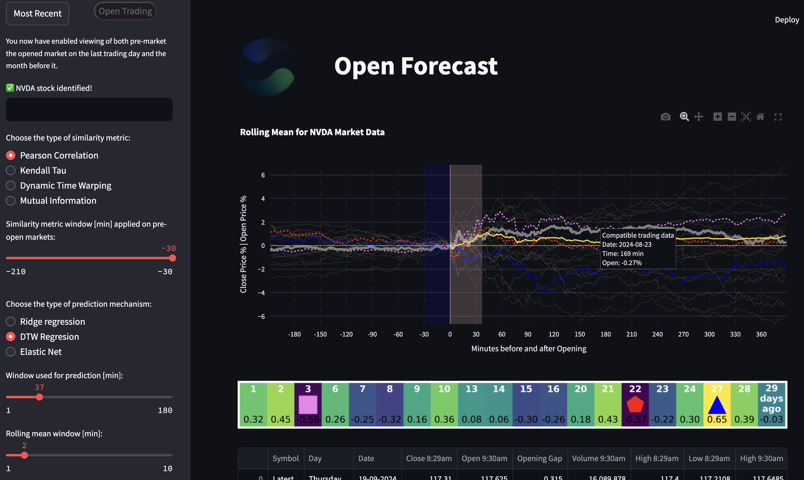

# OpenForecast: Real-Time Stock Price Prediction App



**OpenForecast** is a web-based application built using **Streamlit** that allows users to analyze and predict future stock prices based on machine learning techniques. It utilizes the pre-opening stock prices of previous days to forecast future trends, helping users make informed financial decisions. The application fetches real-time stock data, performs analysis, and visualizes the trends for a better understanding of the market. Check it out in full action here: [Open Forecast](https://open-forecast.streamlit.app/)

## Folder Structure

```plaintext
- streamlit_app.py       # Main entry point for the Streamlit-based web application
- Scripts/
    - dummy.py           # Stores a random number triggering data updates
    - refresh.py         # Generates random numbers and updates dummy.py to trigger stock data collection
    - stock_plotter.py   # Visualizes stock data using Plotly and Matplotlib
    - stock_collectors.py# Collects stock data from Yahoo Finance
    - stock_analyzers.py # Analyzes stock data with machine learning techniques
```

## Main File: `streamlit_app.py`

The `streamlit_app.py` script serves as the core of the **OpenForecast** app, offering a user-friendly web interface that facilitates real-time stock data analysis and prediction. Here's an overview of its functionality:

- **User Interface**: Built using **Streamlit**, providing an interactive and real-time dashboard for stock price analysis and forecasting.
- **Data Refreshing**: Monitors changes in `dummy.py` to trigger updates of stock data. When a new random number is generated in `dummy.py` (via `refresh.py`), the app detects the change and initiates a fresh stock data collection from Yahoo Finance using `stock_collectors.py`.
- **Real-time Stock Data**: Collects stock data at regular intervals or upon detection of a trigger, ensuring that the predictions are based on the most up-to-date information.
- **Stock Forecasting**: Implements machine learning techniques to predict future stock prices based on historical pre-opening prices and other relevant data points.
- **Data Visualization**: Uses `stock_plotter.py` to create interactive plots (via **Plotly** and **Matplotlib**) for a detailed view of historical and predicted stock prices.

## Scripts Overview

- **`dummy.py`**: 
  - Stores a randomly generated number, which acts as a flag or signal for the main app (`streamlit_app.py`) to detect when new stock data should be collected. This simple script is crucial for the automated stock data update mechanism. It updates every minute. The main app is only triggered when the market is open.

- **`refresh.py`**: 
  - Contains the `refresher` function, which periodically generates a random number and stores it in `dummy.py`. The change in `dummy.py` triggers the app to fetch the latest stock prices from Yahoo Finance. This mechanism ensures that the app remains up-to-date without constant user intervention.

- **`stock_plotter.py`**: 
  - Responsible for visualizing stock data through interactive plots. It uses **Plotly** for dynamic charts and **Matplotlib** for more traditional graphs. These visualizations help users understand stock price trends and forecasts at a glance.

- **`stock_collectors.py`**: 
  - This script fetches real-time and historical stock data using **Yahoo Finance (yfinance)**. It processes this data with **Pandas**, preparing it for analysis and visualization. The collected data focuses on pre-opening prices and other key metrics that are important for accurate forecasting.

- **`stock_analyzers.py`**: 
  - Implements advanced stock data analysis using machine learning algorithms. It uses **Dynamic Time Warping (DTW)** to compare different stock patterns and trends, helping predict future price movements based on historical data. In also uses ridge regression and elastic net. More prediction models will be added in a near future.

---

## Key Features

1. **Real-Time Data Collection**: Automatically collects up-to-date stock data from Yahoo Finance based on changes detected in the `dummy.py` file.
2. **Interactive Visualizations**: Provides detailed and interactive stock price charts, helping users analyze trends over time.
3. **Stock Forecasting**: Utilizes machine learning to predict future stock prices based on historical data, particularly pre-opening prices.
4. **Automated Data Updates**: `refresh.py` periodically updates `dummy.py`, ensuring that the app continuously fetches and displays the latest stock information.
5. **User-Friendly Web App**: **OpenForecast** is designed to be intuitive and accessible, providing complex financial insights in a simple web interface.

## How to Run

1. Install required dependencies using the following command:
   ```bash
   pip install -r requirements.txt
   ```
2. Run the **OpenForecast** app:
   ```bash
   streamlit run streamlit_app.py
   ```
3. Access the app via your browser and start exploring stock data visualizations and forecasts.
